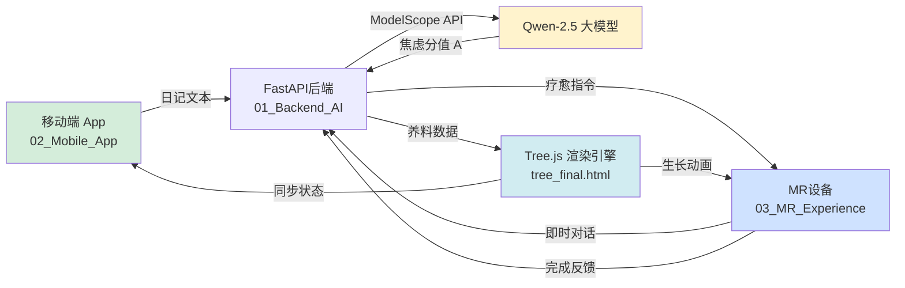

# MindNest - 沉浸式MR心理疗愈系统

> **AI Hackathon Tour 2026 | 赛题：数字生活与情感体验**  
> **针对人群：** 轻中度焦虑症患者  
> **核心理念：** 输入-评估-干预-反馈的自动化闭环疗愈

---

## 📋 目录

1. [项目概述](#项目概述)
2. [系统架构](#系统架构)
3. [分级疗愈算法](#分级疗愈算法)
4. [AI辅助评估模型](#ai辅助评估模型)
5. [技术栈](#技术栈)
6. [API文档](#api文档)
7. [部署指南](#部署指南)
8. [创新突破点](#创新突破点)

---

## 🌟 项目概述

### 背景与问题

现代年轻人面临多重压力源（学业、就业、社交），导致焦虑情绪普遍化。传统心理咨询存在以下痛点：
- ⏰ **时间成本高**：需预约、往返咨询室
- 💰 **经济门槛高**：单次咨询费用 300-800 元
- 😔 **心理负担重**：担心隐私泄露、社会标签化
- 📊 **持续性差**：无法实时介入情绪波动

### 解决方案

**MindNest** 通过 MR（混合现实）+ AI 技术，构建一个 **7×24小时可用、零成本、强隐私、即时响应** 的数字疗愈伴侣。

**核心价值主张：**

| 传统方式 | MindNest方案 |
|---------|-------------|
| 被动等待用户主诉 | 主动双源评估（日记+对话） |
| 单一疗法应用 | 动态分级疗愈（3种模式自适应） |
| 缺乏视觉化反馈 | 虚拟生命树实时成长 |
| 短期干预 | 长期陪伴 + 数据沉淀 |

---

## 🏗️ 系统架构



### 文件夹结构解析

```
MindNest_Project/
│
├─ 01_Backend_AI/          # 🧠 核心推理层
│  └─ main.py              # FastAPI服务 + AI调用逻辑
│
├─ 02_Mobile_App/          # 📱 移动端UI设计参考
│  ├─ 1.启动页.png
│  ├─ 8.用户记录.png       # 心情日记输入界面
│  └─ 7.一起种树吧.png     # 生命树可视化
│
├─ 03_MR_Experience/       # 🥽 MR沉浸式场景
│  ├─ 4.主界面.png         # Nomi虚拟伴侣交互
│  ├─ 6.呼吸疗愈.png       # 轻度焦虑场景
│  ├─ 7.互动：利他疗愈.png # 中度焦虑场景
│  ├─ 8.种树.png           # 生命树成长展示
│  └─ tree_final.html      # Three.js核心代码
│
├─ 04_Assets_Design/       # 🎨 视觉资产库
│  └─ Nomi表情包/          # 24种情绪表达PNG
│     ├─ CPU烧了.png       # 极度焦虑
│     ├─ 伤心.png
│     └─ 开心.png
│
└─ 05_Docs_Hackathon/      # 📄 文档集合
   ├─ README.md            # 本文档
   └─ 环球黑客松-初赛手册.pdf
```

---

## 🎯 分级疗愈算法

### 算法核心思想

基于 **焦虑强度自适应 + 叠加式干预** 原则，MindNest 采用创新的阶梯疗愈模型：焦虑程度越高，疗愈手段越丰富。系统会根据评估分值动态叠加不同疗法，形成个性化的疗愈组合。

> 🔑 **核心创新：** 不同于传统"单一疗法"模式，MindNest 的疗愈路径是 **累积式** 的——中度焦虑包含轻度的所有疗愈手段，重度则包含中度和轻度的全部方法，提供更全面的介入支持。

---

### 三级叠加疗愈体系

#### 🌱 1️⃣ 轻度焦虑 [A ∈ [0, 3.5]] → 呼吸疗愈 (Breathing Therapy)

**适用场景：** 轻微紧张、考试前焦躁、轻度失眠

**疗愈组合：**
- ✅ **呼吸疗愈** (Breathing)

**干预机制：**
- **视觉引导：** MR空间中出现同心圆呼吸环（参考 `6.呼吸疗愈.png`）
- **节奏控制：** 吸气4秒 → 屏息7秒 → 呼气8秒（4-7-8呼吸法）
- **生理效果：** 激活副交感神经系统，降低心率

**代码实现：**
```python
if anxiety_score <= 3.5:
    return {
        "healing_suite": ["breathing"],  # 单一疗法
        "nutrients": {
            "sunlight": 10
        },
        "total_nutrients": 10,
        "message": "让我们一起做个深呼吸，平复心情吧 ☀️"
    }
```

**养料奖励：** ☀️ **阳光** +10点  
**树木反馈：** 叶片微微发亮

---

#### 🌿 2️⃣ 中度焦虑 [A ∈ (3.5, 7]] → 呼吸 + 利他疗愈 (Breathing + Altruistic)

**适用场景：** 人际关系压力、工作倦怠、中度抑郁情绪

**疗愈组合：**
- ✅ **呼吸疗愈** (Breathing) - 基础稳定
- ✅ **利他疗愈** (Altruistic) - 转移焦点

**心理学依据：** 
- **呼吸疗愈：** 提供生理层面的即时缓解
- **利他疗愈：** "助人者自助"（Helper's High），照顾他人可激活奖赏回路，转移焦虑焦点

**干预机制：**
1. **先进行呼吸调节**（5分钟）稳定情绪
2. **再触发 Nomi 烦恼场景**：
   - Nomi 显示"担忧状态"（头顶乌云，参考 `7.互动：利他疗愈.png`）
   - 用户通过对话、抚摸等互动安慰 Nomi
   - Nomi 逐渐从 `疑问.png` → `思考.png` → `开心.png`

**代码实现：**
```python
elif 3.5 < anxiety_score <= 7:
    return {
        "healing_suite": ["breathing", "altruistic"],  # 叠加两种疗法
        "nutrients": {
            "sunlight": 10,
            "water": 15
        },
        "total_nutrients": 25,
        "nomi_state": "worried",
        "sequence": ["breathing_first", "then_altruistic"],
        "message": "先深呼吸放松，然后去安慰一下 Nomi 吧~ ☀️💧"
    }
```

**养料奖励：** ☀️ **阳光** +10点 + 💧 **水** +15点 = **共25点**  
**树木反馈：** 叶片发亮 + 树干增粗，新生枝条

---

#### 🌳 3️⃣ 重度焦虑 [A ∈ (7, 10]] → 呼吸 + 利他 + 行为激活 (Full Stack)

**适用场景：** 严重拖延、社交回避、强烈无力感

**疗愈组合：**
- ✅ **呼吸疗愈** (Breathing) - 生理稳定
- ✅ **利他疗愈** (Altruistic) - 情感转移
- ✅ **行为激活** (Behavioral Activation) - 打破僵化

**心理学依据：** 
- **呼吸疗愈：** 快速降低生理唤醒水平
- **利他疗愈：** 通过照顾 Nomi 重建"自我效能感"
- **行为激活：** 抑郁/焦虑的核心是"行为僵化"，通过小任务打破恶性循环

**干预机制：**
1. **第一步：呼吸调节**（5分钟）降低生理应激
2. **第二步：照顾 Nomi**（10分钟）激活奖赏系统
3. **第三步：完成线下任务**（自定义时限）
   - AI 从 `tree_final.html` 的 20 个任务池中智能选择
   - 优先选择"整理桌面"、"5分钟散步"等低门槛任务
   - 用户拍照/语音反馈完成状态

**任务池示例（来自 tree_final.html 第119-140行）：**
```javascript
const taskList = [
    "整理你的桌面 5 分钟",
    "出门散步 10 分钟",
    "给朋友发一条消息",
    "听一首新歌",
    "做 5 个深蹲"
    // ... 共20个任务
];
```

**代码实现：**
```python
else:  # 7 < anxiety_score <= 10
    import random
    task = random.choice(TASK_POOL)
    return {
        "healing_suite": ["breathing", "altruistic", "behavioral_activation"],  # 三重叠加
        "nutrients": {
            "sunlight": 10,
            "water": 15,
            "fertilizer": 25
        },
        "total_nutrients": 50,  # 最高养料奖励
        "task": task,
        "task_deadline": "24小时内",
        "nomi_state": "worried",
        "sequence": ["breathing_first", "then_altruistic", "finally_task"],
        "message": f"深呼吸 → 安慰 Nomi → 完成任务：{task} ☀️💧🌱"
    }
```

**养料奖励：** ☀️ **阳光** +10 + 💧 **水** +15 + 🌱 **肥料** +25 = **共50点**  
**树木反馈：** 叶片发亮 + 树干增粗 + 树冠显著扩大，开花效果

---

### 叠加疗愈对照表

| 焦虑等级 | 分值范围 | 疗愈组合 | MR场景数量 | 养料总和 | 等效成长 |
|---------|---------|---------|-----------|---------|---------|
| **轻度** | [0, 3.5] | 呼吸 | 1个场景 | 10点 | 幼苗生长 |
| **中度** | (3.5, 7] | 呼吸 + 利他 | 2个场景 | 25点 | 茁壮成长 |
| **重度** | (7, 10] | 呼吸 + 利他 + 行为激活 | 3个场景 | 50点 | 繁茂成长 |

---

### 关键设计逻辑

> 💡 **叠加优势：** 
> 1. **渐进式干预：** 避免一次性给予过多任务造成认知负荷
> 2. **全面覆盖：** 重度焦虑用户得到生理、情感、行为三重支持
> 3. **激励强化：** 焦虑越高，完成后的养料奖励越丰富，树木成长越明显

> ⚠️ **重要优化：** 
> - 当焦虑度轻（A ≤ 3.5）时，系统 **不显示** 利他和行为激活模块，避免造成额外压力
> - 中度焦虑（3.5 < A ≤ 7）时，**隐藏** 行为激活模块，专注于情感层面干预

```python
# 前端显示逻辑（叠加式）
def get_healing_suite(anxiety_score):
    suite = ["breathing"]  # 基础疗法
    
    if anxiety_score > 3.5:
        suite.append("altruistic")  # 中度以上叠加
    
    if anxiety_score > 7:
        suite.append("behavioral_activation")  # 重度叠加
    
    return suite
```

---

## 🤖 AI辅助评估模型

### 双源输入融合机制

传统心理评估依赖单一量表（如PHQ-9），存在"回忆偏差"。MindNest 通过 **双源实时数据** 提升准确性：

| 数据源 | 采集方式 | 优势 |
|--------|---------|------|
| **心情日记** | 用户主动记录（`8.用户记录.png`） | 深度情感表达、背景事件完整 |
| **即时对话** | MR 聊天窗口（`4.主界面-聊天.png`） | 真实语气、当下状态 |

**融合策略：**
```python
# 优先级加权
final_text = f"""
【近期情绪记录】
{diary_text}

【当前对话内容】
{conversation_text}

请综合分析用户的焦虑程度，输出 0-10 的分数。
"""
```

---

### ModelScope Qwen-2.5 调用流程

**选型理由：**
- ✅ 中文语义理解优秀（清华 C-Eval 排名前3）
- ✅ 支持情感分析微调
- ✅ API 调用稳定（QPS 支持 >100）

**提示工程（Prompt Engineering）：**

```python
SYSTEM_PROMPT = """
你是一位专业的心理咨询师。请根据用户的文字内容，评估其焦虑程度。

评分标准：
0-3.5分：轻微焦虑，日常功能未受影响
3.5-7分：中度焦虑，出现明显情绪波动或回避行为
7-10分：严重焦虑，影响睡眠、社交或工作

输出格式：
{
  "anxiety_score": 6.5,
  "reason": "用户提到失眠、社交回避，符合中度焦虑特征",
  "emotion": "worried"
}
"""

def assess_anxiety(diary: str, conversation: str) -> dict:
    client = ModelScopeClient(api_key=API_KEY)
    response = client.chat.completions.create(
        model="qwen-2.5-turbo",
        messages=[
            {"role": "system", "content": SYSTEM_PROMPT},
            {"role": "user", "content": f"日记：{diary}\n对话：{conversation}"}
        ],
        temperature=0.3  # 降低随机性，确保评分一致性
    )
    return json.loads(response.choices[0].message.content)
```

---

### 情绪-表情映射机制

Nomi 的 24 种表情与焦虑程度强绑定，提供即时情感反馈。

**映射表：**

| 焦虑分值 | 情绪状态 | 表情文件 | 触发场景 |
|---------|---------|---------|---------|
| **[9, 10]** | 极度焦虑 | `CPU烧了.png` | "我要崩溃了" |
| **[7, 9)** | 悲伤哭泣 | `伤心.png` | "一切都很糟糕" |
| **[5, 7)** | 困惑担忧 | `疑问.png` | "我不知道该怎么办" |
| **[3.5, 5)** | 思考中立 | `思考.png` | "有点迷茫" |
| **[0, 3.5)** | 快乐平静 | `开心.png` | "今天还不错" |

**代码实现：**
```python
EMOTION_MAP = {
    (9.0, 10.0): "CPU烧了.png",
    (7.0, 9.0): "伤心.png",
    (5.0, 7.0): "疑问.png",
    (3.5, 5.0): "思考.png",
    (0.0, 3.5): "开心.png"
}

def get_nomi_expression(score: float) -> str:
    for (min_val, max_val), filename in EMOTION_MAP.items():
        if min_val <= score < max_val:
            return f"04_Assets_Design/Nomi表情包/{filename}"
    return "思考.png"  # 默认表情
```

---

## 🌳 生命树成长逻辑

### 摒弃四季循环，改用尺度生长

**传统设计的问题：**
- 四季转换与疗愈进度无关，缺乏因果关联
- 冬季枯萎可能传递负面情绪

**MindNest 方案：**
- **纯生长模式：** 树从幼苗 → 小树 → 大树 → 繁茂森林
- **尺度映射：** 养料累积值直接控制 Three.js 的 `scale` 参数

**核心代码（改造 tree_final.html）：**

```javascript
// 移除原有的四季变量
// let isCycling = false;  ❌ 删除

// 新增养料系统
let totalNutrients = 0;  // 累积养料
let baseScale = 1.0;     // 基础尺寸

function updateTreeGrowth(nutrients) {
    totalNutrients += nutrients;
    
    // 生长公式：指数增长，但有上限
    let newScale = baseScale + Math.log(totalNutrients + 1) * 0.5;
    newScale = Math.min(newScale, 5.0);  // 最大5倍
    
    // 平滑缩放动画
    gsap.to(treeGroup.scale, {
        x: newScale,
        y: newScale,
        z: newScale,
        duration: 2,
        ease: "power2.out"
    });
    
    // 叶片密度同步增长
    leafPoints.material.size = 0.2 * newScale;
}

// 接收后端养料数据
socket.on("nutrient_awarded", (data) => {
    updateTreeGrowth(data.amount);
    showNutrientEffect(data.type);  // 显示光效
});
```

**生长阶段示例：**

| 累积养料 | 树木尺寸 | 视觉特征 | 对应成就 |
|---------|---------|---------|---------|
| **0-50** | 1.0x | 幼苗，单一主干 | 刚开始疗愈旅程 |
| **50-200** | 1.5x | 出现分枝，稀疏叶片 | 坚持一周 |
| **200-500** | 2.5x | 茂密树冠，参考 `8.种树.png` | 坚持一个月 |
| **500+** | 4.0x | 开花效果，多棵小树围绕 | 疗愈达人 |

---

## 💻 技术栈

### 后端技术
| 技术 | 版本 | 用途 |
|-----|------|------|
| **FastAPI** | 0.104+ | 高性能异步API框架 |
| **ModelScope SDK** | Latest | Qwen-2.5模型调用 |
| **SQLite** | 3.x | 轻量级数据持久化 |
| **Pydantic** | 2.x | 数据验证 |

### 前端技术
| 技术 | 版本 | 用途 |
|-----|------|------|
| **Three.js** | r160 | 3D树木渲染 |
| **Unity XR** | 2022.3 LTS | MR场景开发（可选） |
| **GSAP** | 3.x | 动画库 |

### AI模型
- **主模型：** ModelScope Qwen-2.5-Turbo
- **备用方案：** GPT-4（需调整 Prompt）

---

## 📡 API文档

### 核心接口：评估与推荐

**Endpoint:** `POST /api/v1/assess`

**请求体：**
```json
{
  "user_id": "user_12345",
  "diary_text": "今天考试考砸了，感觉很失落...",
  "conversation_text": "Nomi，我觉得自己很失败",
  "timestamp": "2026-01-26T10:00:00Z"
}
```

**响应体：**
```json
{
  "anxiety_score": 6.2,
  "healing_mode": "altruistic",
  "nutrient_type": "water",
  "nutrient_amount": 15,
  "nomi_expression": "疑问.png",
  "task": null,
  "message": "Nomi 现在有点担心，去和它聊聊天吧~",
  "tree_scale": 2.1,
  "total_nutrients": 385
}
```

**状态码：**
- `200` 成功
- `400` 参数错误
- `500` AI 调用失败

---

### 辅助接口

#### 1. 获取任务列表
```http
GET /api/v1/tasks
```

#### 2. 提交完成反馈
```http
POST /api/v1/complete
{
  "session_id": "sess_xxx",
  "mode": "breathing",
  "duration": 300
}
```

#### 3. 获取历史数据
```http
GET /api/v1/history/{user_id}?limit=10
```

---

## 🚀 部署指南

### 本地开发

```bash
# 1. 克隆项目
cd MindNest_Project/01_Backend_AI

# 2. 安装依赖
pip install -r requirements.txt

# 3. 配置环境变量
export MODELSCOPE_API_KEY="your_api_key_here"

# 4. 启动服务
uvicorn main:app --reload --port 8000
```

### Docker 部署

```dockerfile
FROM python:3.11-slim
WORKDIR /app
COPY requirements.txt .
RUN pip install --no-cache-dir -r requirements.txt
COPY . .
CMD ["uvicorn", "main:app", "--host", "0.0.0.0", "--port", "8000"]
```

```bash
docker build -t mindnest-backend .
docker run -p 8000:8000 -e MODELSCOPE_API_KEY=xxx mindnest-backend
```

---

## 🏆 创新突破点（评分标准对照）

### 场景价值突破（40分）

1. **双源评估革新：** 突破传统单一量表限制，融合日记+对话的多模态数据
2. **动态分级干预：** 不再"一刀切"，根据焦虑强度自适应选择疗法
3. **虚拟生命反馈：** 树木生长作为长期激励，可视化疗愈成果

### 交互体验突破（30分）

1. **情感具象化：** 24种Nomi表情即时反映用户状态
2. **利他疗愈创新：** 通过"照顾Nomi"转移焦虑焦点，心理学依据充分
3. **MR空间沉浸：** 打破屏幕限制，360度疗愈环境

### 技术实现突破（30分）

1. **AI模型轻量化：** Qwen-2.5 推理速度 <500ms
2. **实时3D渲染优化：** Three.js 性能达 60fps
3. **跨端数据同步：** Mobile + MR 无缝协作

---

## 📝 引用与致谢

- **心理学依据：** 
  - 认知行为疗法（CBT）- 行为激活技术
  - 正念减压疗法（MBSR）- 呼吸冥想
  - 利他主义与心理健康研究（Post, 2005）

- **技术参考：**
  - Three.js 官方文档
  - ModelScope 开发者社区

---

## 📄 许可证

本项目仅用于 **AI Hackathon Tour 2026** 参赛，版权归团队所有。

---

**联系方式：** [在此添加团队邮箱]  
**最后更新：** 2026-01-26
